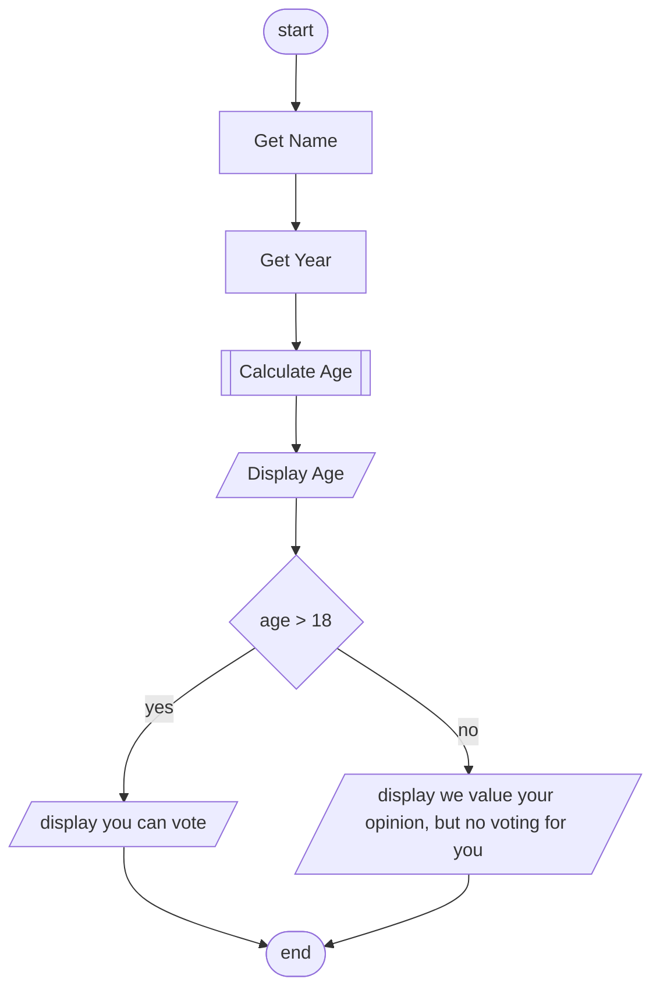

# Python Classes References / Tutorials

### Written Tutorials

- Real Python. (2024). Python Classes: The Power of Object-Oriented Programming – Real Python. Realpython.com. https://realpython.com/python-classes/
- Murphy, W. (2020, February 10). Implementing an Interface in Python. Realpython.com; Real Python. https://realpython.com/python-interface/
- Ramos, L. P. (2025, January 19). Python Class Constructors: Control Your Object Instantiation. Realpython.com; Real Python. https://realpython.com/python-class-constructor/
- Ramos, L. P. (2025, January 12). Variables in Python: Usage and Best Practices. Realpython.com; Real Python. https://realpython.com/python-variables/
- Rodriguez, I. (2025, January 11). Inheritance and Composition: A Python OOP Guide. Realpython.com; Real Python. https://realpython.com/inheritance-composition-python/
- Ramos, L. P. (2024, February 26). Duck Typing in Python: Writing Flexible and Decoupled Code. Realpython.com; Real Python. https://realpython.com/duck-typing-python/
- Ramos, L. P. (2025, January 20). Getters and Setters: Manage Attributes in Python. Realpython.com; Real Python. https://realpython.com/python-getter-setter/
    
### Video Tutorials
- Bro Code. (2024, July 7). Python Object-Oriented Programming (Full Course). Youtube.com. https://www.youtube.com/watch?v=IbMDCwVm63M
- Idently. (2024, August 30). Learn Python OOP in 20 Minutes. Youtube.com. https://www.youtube.com/watch?v=rLyYb7BFgQI
- Python Simplified. (2021, July 16). Python Classes and Objects - OOP for Beginners. Youtube.com. https://www.youtube.com/watch?v=f0TrMH9s-VE
- Python Simplified. (2022, March 22). OOP Class Inheritance and Private Class Members - Python for Beginners. Youtube.com. https://www.youtube.com/watch?v=6c6NYPjO_rI&list=PLqXS1b2lRpYRCbHe3sG5viisehpADOWUv&index=3
- Python Simplified. (2022, November 27). If __name__ == “__main__” for Python Developers. Youtube.com. https://www.youtube.com/watch?v=NB5LGzmSiCs

#### More advanced topics (for second semester)
- Python Simplified. (2022, November 8). Python TDD Workflow - Unit Testing Code Example for Beginners. Youtube.com. https://www.youtube.com/watch?v=ibVSPVz2LAA&list=PLqXS1b2lRpYRCbHe3sG5viisehpADOWUv&index=5

# Mermaid Flowcharts

