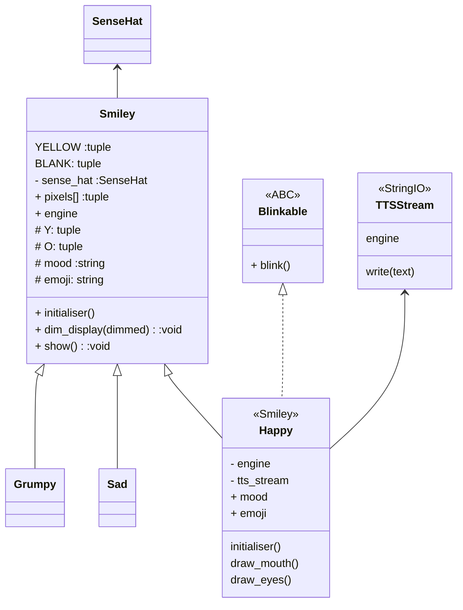

# Smiley Class Diagram

To activate Mermaid and/or PlantULML

- CTRL+ALT+S (settings)
- Click on Plugins
- Search for Mermaid/PlantUML in the Marketplace
- Click Install
- Click Apply

```mermaid
classDiagram
    Smiley <|-- Happy
    Smiley <|-- Sad
    Smiley <|-- Grumpy
    Blinkable <|.. Happy
    SenseHat <-- Smiley
    TTSStream <-- Happy 
    


    class Smiley {
        YELLOW :tuple
        BLANK: tuple
        
        - sense_hat :SenseHat
        + pixels[] :tuple
        + engine 
        # Y: tuple
        # O: tuple
        # mood :string
        # emoji: string 

        + initialiser()
        + dim_display(dimmed) :void
        + show() :void
    }


    class Blinkable{
        <<ABC>>

        + blink()
    }

    class Happy{
        <<Smiley>>
        
        - engine
        - tts_stream
        + mood
        + emoji

        initialiser()
        draw_mouth()
        draw_eyes()        
    }

    
    class TTSStream{
        <<StringIO>>

        engine
        write(text)
    }    
```
