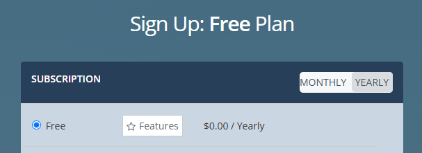
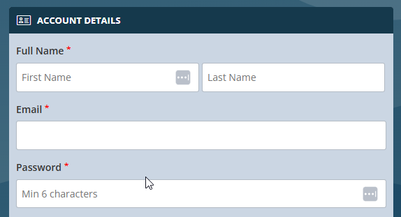

# Example of using an API in Python
#
# IMPORTANT: This is a WIP

Weather APIS need to have accounts

List of **possibly** free APIS (not just weather)

- Public APIs. (2025). A Collaborative List Of 1400+ Public APIs For Developers. Public APIs. https://publicapis.dev/
- A collective list of APIs. Build. (2019). Apilist.fun. https://apilist.fun/
- Team, A. (2024, March 12). Free API - 90+ Public APIs For Testing [No Key] - Apipheny. Apipheny. https://apipheny.io/free-api/
- Free APIs. (2025). Github.io. https://free-apis.github.io/#/
- Free Public APIs for Developers. (2024). Rapidapi.com. https://rapidapi.com/collection/list-of-free-apis
- APILayer | Hassle-free API marketplace. (2024). Apilayer.com. https://apilayer.com/?utm_source=Github&utm_medium=Referral&utm_campaign=Public-apis-repo


> **WE DO NOT ENDORSE ANY INDIVIDUAL COMPANY**
> 
> PLEASE USE ANY SOURCE AT YOUR OWN RISK
> 
> **NO LIABILITY IS IMPLIED OR ACCEPTED FOR MISUSE OF DATA IN ANY FORM**

This example uses: https://weatherstack.com

Documentation: https://weatherstack.com/documentation

To test this example, you will need an API key.

To obtain a free key use these steps:

1. Go to **[https://weatherstack.com](https://weatherstack.com)**
2. Click "Sign Up Free" 
3. Select Yearly and Free Subscription 
4. Fill out Account Details 


To run the demo you will need to:

1. open Windows Terminal with the Git Bash CLI 
2. Create a folder `weatherstack_demo`

```shell
mkdir weatherstack_demo
```
3. change into the folder
```shell
3. cd weatherstack_demo
```
4. install and activate Python Virtual Environment
```shell
python -m venv .venv
source .venc/Scripts/activate
```
5. install the Http.client
```shell
5. pip install http.client
```
6. copy the .weather-stack.env to .env
```shell
cp .weatherstack.env .env
```
7. update the .env file with YOUR weatherstack details

8. execute the code
```shell
python weatherstack-demo.py 
```